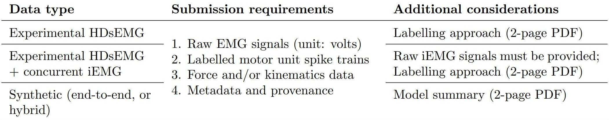

Thanks you for choosing to submit a dataset to the MUnitQuest and welcome to the MUnitQuest Dataset Submission Guide. 

Depending on the type of dataset a submission consists of the following parts: 

# Part 1: 2-page pdf 
We require either a: 
2-page description of the labelling approach (for experimental data), or a 2-page description of the model (for synthetic data). 

# Part 2: Labeled Spike Trains
We require a *.tab* file containing the labeled Spike Trains. 

# Part 3: Raw data (EMG, iEMG, force & kinematics) and Metadata 
Finally we require a set of files containing the raw data and accompaninying metadata: 

The raw EMG, iEMG, force & kinematics data and metadata in the MUnitQuest competition will be in [BIDS](https://bids.neuroimaging.io/) format while also following [CEDE guidelines](https://pubmed.ncbi.nlm.nih.gov/36571885/). 

Datasets in BIDS format consist of *.edf* or *.bdf* files for the raw data (EMG, iEMG, force, kinematics) and several accompanying .json and .tsv files that store metadata. 

On this page we provide instructions for creating the files we require. 

Our explanation covers the most common types of datasets we expect people to submit. These are: 
- Datasets containing only **HDsEMG grid(s)** 
- Datasets containing **HDsEMG grid(s) and concurrent invasive EMG** (fine wire(s), concentric needle(s) or thin filament(s))
- **Synthetic** Datasets based on Simulation

We also provide examples you can base your files on. **If your dataset does not fit into this scheme you can and should still submit it!** Simply contact us and we will provide assistance. 

contact email: TODO 

### Short Intro into BIDS standard
Data in this competition will be in [BIDS](https://bids.neuroimaging.io/) format. **We do not require a complete and exhaustive conversion of your dataset to BIDS. We only require a comparatively small subset of essential information.** This guide is intended to make it as easy as possible to convert your dataset. Here is the full [BIDS EMG Documentation](https://bids-specification.readthedocs.io/en/latest/modality-specific-files/electromyography.html).

The main body in a BIDS dataset is in *.edf*, *.edf+*, *.bdf* or *.bdf+* format. You do not need to submit your data in this format. You can submit *.mat* (matlab) files or *.npy* (numpy) files and we handle conversion to BIDS formats. 

The metadata of the dataset will be in several different *.json* and *.tsv* files. Some of these we require you to create when you submit your dataset. We will explain what we need and provide examples you can base your files on. 

### We expect homogenous data
Datasets should have the same setup (electrodes and electrode placement) for each participant. Minor deviations like a missing electrode are okay, and can be specified accordingly in the metadata (more on this later). 
But if your dataset contains major deviations between participants it should be split into smaller homogenous datasets. 

If your data was collected with more than one amplifier contact us. 

### Synthetic datasets 
If your dataset is the result of a simulation, simply pretend as if it were measured experimentally while submitting the dataset. Use "n/a" for datafields that no longer make sense in a simulated context, such as manufacturer name of amplifier or PowerLineFrequency. 

## Overview of required files 
For initial submission of your dataset we require the following files: 
- Photo(s) of experimental setup and electrode wiring 
- dataset_description.json
- participants.json
- participants.tsv
- emg.json
- electrodes.tsv 
- channels.tsv 
- additionalInformation.json
- the raw data in the form of *.mat* or *.npy* or *.edf* or *.bdf* files 

**We do not require _coordsystem.json for initial submission.** But we will require it once your dataset has been accepted. 

### Our example files 
We provide example files in [this Github repository](https://github.com/MUnitQuest/startkit), you can base your files on. This hopefully covers the most common types of experimental setups. As mentioned before, don't hesitate to contact us for help. 

Further, each required file is explained below. 

### Photo of experimental setup
- Photo that shows placement of electrodes on the body. Include at least one adjacent joint for context. 
- Photo or drawing that shows electrode names

It's also possible to combine both these photos into one.

### dataset_description.json
A short .json file where you specify authors of the dataset and its related publication as well as a license and the ethics approval. 

### Participants.json
A file defining which columns exist in the participants.tsv file. 
- **name:** Unique subject identifier. Every name must start with "sub-". For example: sub-01, sub-02, etc. 
All other entries (age, sex, handedness, weight, height, group) are optional. You can add new entries as needed. 

### Participants.tsv 
A file containing participant information. Columns are defined in participants.json. 

### emg.json
A .json file that specifies some general information about the experimental setup. 

<!-- EMGPlacementScheme: don't ask, will sort this in follow up if dataset accepted -->
- **EMGPlacementSchemeDescription:** Describe how electrodes are placed. Include anatomical landmarks used to position. Include the measurement method for placement. Include placement of reference electrode(s). Include placement of ground electrode. Include if a dry linear array for fiber alignment was used or not. Include if innervation zone was measured and how electrodes are positioned relative to it. For different types of electrodes (surface grid, invasive grid, fine wire, etc) use i), ii), iii), ... to separate placement description (similar to our provided example). 
- **EMGReference:** Leave it as "channelspecific".  
- **EMGGround:** The name of the ground electrode (specified in electrodes.tsv). 
- **SamplingFrequency:** The main sampling frequency (in Hz) of your data. If some channels of your data have a different sampling frequency contact us. 
- **PowerLineFrequency:** Frequency (in Hz) of the power grid where the data was recorded. 
- **SoftwareFilters:** A json object containing filter parameters (see example emg.json file). Use "n/a" if no filter was used.
- **Taskname:** Name of the task done by participant. If multiple tasks were performed, list them by using "i), ii), iii)". 
- **TaskDescription:** Description for each task. 
- **Preamplification:** Amplification built into an EMG bipolar sensor, electrode grid, or other device.
- **Gain:** Signal gain from an in-line amplifier, applied between the EMG sensor/device and the data acquisition computer. 
- **Manufacturer:** Manufacturer of the amplifier used to collect the data. 
- **ManufacturerModelName:** Model name of the amplifier. 

### Electrodes.tsv
Contains information about the electrodes used. Such as geometry of grid(s), electrode surface area, material, manufacturer, type, etc. 

- **name:** Name of a single electrode. Can be any string containing letters and numbers. Every electrode needs a unique name. 
- **x:** X-coordinate of the electrode in its child coordinate system. More on coordinate systems below. 
- **y:** Y-coordinate of the electrode in its child coordinate system.
- **z:** Z-coordinate of the electrode in its child coordinate system. Usually this is left empty. 
- **coordinate_system:** Name of the child coordinate System. 
- **group:** Name of the group this electrode belongs to. 
- **electrodeMaterial:** Material the electrode surface is made from. 
- **interelectrodeDistance:** Distance between electrodes. In a grid this means distance between neighboring electrodes. In a fine wire it means distance between the wire tips. 
- **electrodeSurfaceArea:** Surface area of the electrode. For fine wire this will be "n/a" because FineWireDiameter and FineWireRecordingTipLength already specify surface area. 
- **fineWireDiameter:** Diameter of the fine wire tip. "n/a" for every electrode that is not a fine wire. Column can be deleted if no fine wire present. 
- **fineWireRecordingTipLength:** Unisolated length of the fine wire tip. "n/a" for every electrode that is not a fine wire. Column can be deleted if no fine wire present. 
- **concentricNeedleDiameter:** Concentric needle size/gauge. "n/a" for every electrode that is not a concentric needle. Column can be deleted if no concentric needle present. 
- **concentricNeedleLength:** Length of concentric needle. "n/a" for every electrode that is not a concentric needle. Column can be deleted if no concentric needle present. 
- **electrodeManufacturer:** Name of electrode manufacturer. This is optional. 
- **electrodeManufacturersModelName:** Model name of Electrode. This is optional. 
- **electrodeType:** Type of electrode. For example: "HDsEMG", "thin-film HDiEMG", "fine wire", "concentric needle" or "ring". 

#### On Coordinate Systems
BIDS requires that electrodes position on the body be specified. For this, coordinate systems defined by anatomical landmarks are specified in several .json files. For grids of electrodes, positions can be specified in device specific coordinates. These device specific coordinates are then located within parent coordinate systems in additional .json files. **We do not require _coordsystem.json files for initial submission.** If your dataset is accepted we will require these files at a later stage. 

### Channels.tsv 
The channels.tsv file describes channel specific information. For example which channels in the data are derived from which signal and reference electrodes, measurement unit, the frequency of low pass and high pass filters used, etc. 

- **name:** Name of a single channel. Can be any string containing letters and numbers. Every channel needs a unique name. 
- **type:** Type of channel. Must be "EMG" or "MISC" or "TRIG". 
- **unit:** Unit of measurement of the channel. 
- **description:** Description of the channel. 
- **signal_electrode:** Name of the signal electrode. Must match an electrode name specified in electrodes.tsv. 
- **reference_electrode:** Name of the reference electrode. Must match an electrode name specified in electrodes.tsv, except for bipolar electrodes such as fine-wire, use "bipolar" in this case. For data channels that do not come from electrodes (such as force data) can be "n/a". 
- **group:** Name of the group this channel belongs to. 
- **status:** Status of the channel. Optional. Can be used to tag channels which should be ignored in data analysis. Must be "good", "bad" or empty. 
- **low_cutoff:** High-pass filter frequency (in Hz) or "n/a". 
- **high_cutoff:** Low-pass filter frequency (in Hz) or "n/a". 

### additionalInformation.json
A small file that collects information we need, that is not part of BIDS. 
- **bitrate:** Bitrate your data was collected at. We need this to decide whether to convert your *.mat* or *.npy* files to *.edf* (16 bit) or *.bdf* (24  bits). 

### Minor experimental setup deviations between participants
BIDS metadata follows an inheritance principle. In practice this means the following: 

If all your participants have exactly the same experimental setup, you only need to specify each metadata file once, since it is the same for each participant. It will be placed in the top-most directory, on the same level where the folders for each participant are. 

If you have minor deviations from the intended experimental setup in some participants, you still place metadata files in the top-most directory. But additionally you place metadata files inside the folder of the participant that deviates. The metadata files in the lower directory will override the files in the higher directories. Details can be found [here](https://bids-specification.readthedocs.io/en/latest/common-principles.html#the-inheritance-principle). 

# Submitting Data 
This section explains what to do once you have converted your dataset to a format admissible for submission. 

## Python checking script
TODO 

detects inconsistencies

## Uploading your dataset 
TODO 

bwsyncand share 

<!-- we provide python script to check your json file for 
- correct json syntax
- required fields
- correct data types (number, string, etc) -->

