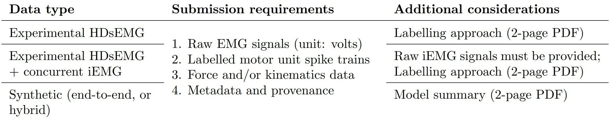

### Starting point 
Applications and resreach questions using motor unit identification methods are diverse and yield heterogeneous EMG datasets, for example regarding tasks, variability between subjects, the utilized electrodes, electrode configuration and data aquistion systems. It is essential to reflect this diversity in the MUnitQuest's data collection. This is only feassible through a community-based effort. So we would be happy if you consider contributing some of your data!

In short, depending on the type of dataset a submission consists of the following parts: 

### Raw Data and Metadata Submission
We will provide all EMG data entering the competition in the standardized [EMG-BIDS](https://bids-specification.readthedocs.io/en/stable/modality-specific-files/electromyography.html) format. To make getting starting with EMG-BIDS as easy as possible we support two options for your data submission:

- Upload of EMG-BIDS formated data, which we facilitate by providing template files that you can adopt according to your specific recording set up
- Assisted generation of EMG-BIDS compatible metadata files through a web interface (comeing soon)

### Labeled Motor Unit Spike Trains
A key requirement for a competition on motor unit identification methods is the existence of labeled ground truth spikes. Thus we additionally require to submit

- for each recording, a *.tsv* file containing the labeled motor unit spike trains
- a short description (2-page PDF) of the utilized labelling approach (for experimental EMG data)
- a short description (2-page PDF) of the simulation model (for synthetic EMG data)
 
